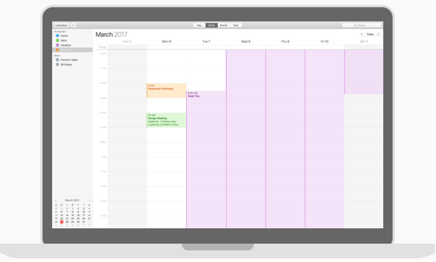

# 全屏模式
全屏模式的应用程序窗口提供了一个无干扰的工作环境。工具栏，菜单和其他标准控件通常仅在用户调用时隐藏和显示，例如将指针移动到屏幕顶部。有些应用程序甚至隐藏了必要的控件来增加对内容的关注。例如，在 QuickTime Player 中播放电影或在照片中播放幻灯片时隐藏了控件。

> **提示**   
> 在配备有触控栏的MacBook Pro型号上，可以利用触控栏直接访问常用功能，而无需用户移动指针或查看叠加在内容上的控件。[请参阅触控栏>架构>全屏和聚焦内容应用](https://developer.apple.com/design/human-interface-guidelines/macos/touch-bar/touch-bar-architecture/#full-screen-and-focused-content-apps) 。

### 仅在合理的情况下启用全屏窗口
当用户想要沉浸在任务中时，全屏模式非常有用，但并非所有应用都需要沉浸。例如，某些实用的应用程序（如计算器）在小窗口模式下停靠在其他应用程序旁边能更好的发挥功能。将 iOS 应用程序移植到 macOS 时，请不要认为应用程序必须支持 macOS 中的全屏模式。

### 在完成任务所需的时候保持工具栏的可见，当焦点在内容上时隐藏它
可以设置全屏窗口始终显示工具栏，或仅当用户将指针移动到屏幕顶部时。例如，日历应用程序始终显示工具栏，提供对基本导航和日程管理控制的快速访问。另一方面，预览会隐藏工具栏，以便用户可以专注于阅读或查看内容。

### 保留对基本功能的访问
确保在全屏环境中仍可使用所有必备工具。用户应该能够在不退出全屏模式的情况下完成任务。

### 为用户在全屏模式中配置辅助窗口
必须正确配置全屏辅助窗口，以便它们可以显示在全屏内容之上。有关开发人员指导，请参阅 [NSWindowCollectionBehaviorFullScreenAuxiliary](https://developer.apple.com/documentation/appkit/nswindowcollectionbehavior/nswindowcollectionbehaviorfullscreenauxiliary)。

### 设计与外部文件的有效交互
用户不需要退出全屏模式来打开文件，导入图像，保存文件或执行其他文件的系统交互。考虑如何在全屏环境中使这些功能可用。例如，如果你需要提供对图像的访问，则可以启用内置图像浏览器。

### 利用额外的屏幕空间，但保持您的界面过渡平稳
全屏时，大多数窗户的宽度和高度都会增加。如果在合适的情况下，你可以细微地调整界面的比例，以便窗户能更好地优化执行重要任务或浏览内容的空间。只要确保这种过渡不会变得不和谐，并且你的界面仍然可识别。例如，当在 Photo Booth 进入全屏模式时，用户永远不会在预览区域中看不到自己。

### 遵守进入 Mission Control 的手势
标准的任务控制手势应该始终有效。即使您的应用程序是唯一关注的焦点，用户也应该能够调用 Mission Control 来快速预览和在打开的窗口，全屏应用程序，桌面，空间和仪表板之间进行导航。此规则也适用于游戏。

### 当用户离开您的应用时，会做出适当的响应
用户应该能够在切换程序后再返回到你的应用程序时，能从他们之前中断的位置恢复。例如，当用户离开应用时，游戏或照片幻灯片放映应自动暂停。

### 让用户选择何时退出全屏模式
当用户切换到另一个应用程序或活动（如播放电影或游戏）结束时，请避免自动退出全屏模式。

### 通常，允许用户显示程序坞
当您的应用处于全屏模式时，保持对程序坞的访问非常重要，这样用户就可以快速打开应用和其他程序坞项目。一个例外是在沉浸式游戏中，屏幕的边缘是游戏体验的一部分。